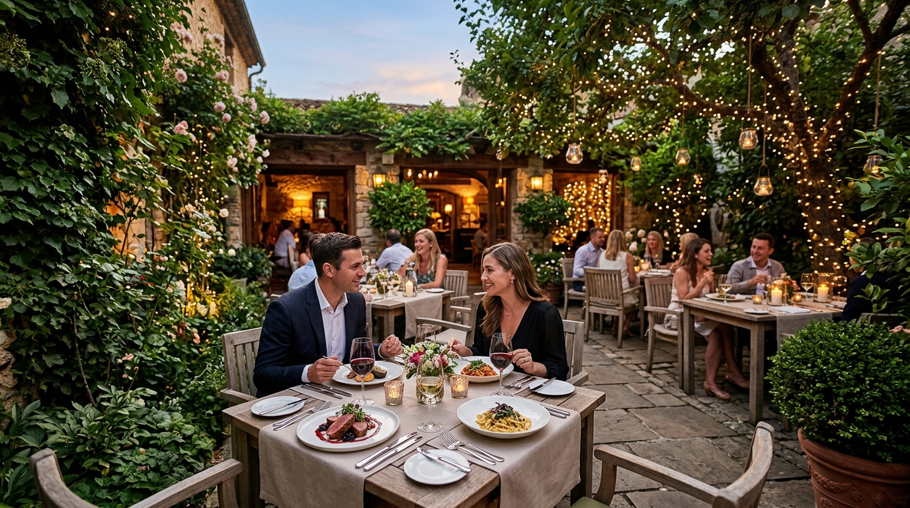
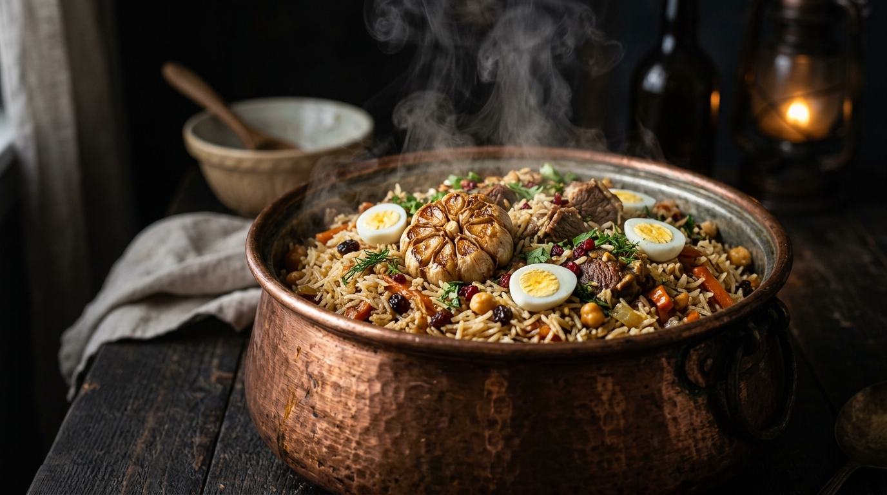
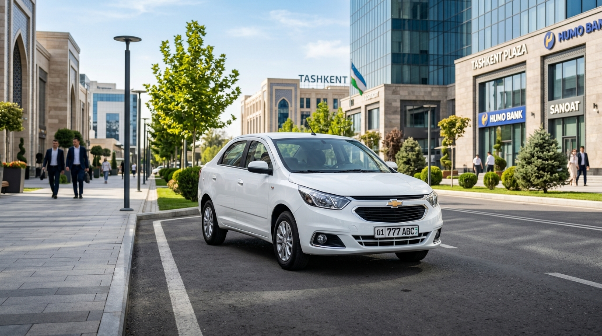

# 📋 Safaar Web-User Portali Uchun Databaza Va Media (Rasm) Talablari Hujjati

> **Mo'ljallangan:** Backend Dasturchilari va Ma'lumotlar Bazasi Arxitektorlariga  
> **Loyiha:** Safaar Monorepo (`web-user` foydalanuvchi ilovasi)  
> **Hujjat Maqsadi:** `web-user` portalini to'liq, jonli va real ma'lumotlar hamda yuqori sifatli rasmlar bilan ta'minlash uchun Prisma schemada yetishmayotgan jadvallar, ustunlar va seed/media talablarini belgilab berish.

---

## 🖼️ 1. Qo'shilishi Kerak Bo'lgan Rasmlar Va Vizual Namunalar (Media Requirements)

Ma'lumotlar bazasida (`media_files` jadvalida hamda `hotels`, `cities`, `vehicles`, `attractions` jadvallarida) quyidagi rasmlar biriktirilishi shart:

### 🌆 1.1. Shaharlar va Turistik Yo'nalishlar (Destinations)

#### Samarqand — Registon Maydoni


#### Buxoro — Eski Shahar va Kalan Minorasi


#### Xiva — Ichan-Qal'a Panoramasi


#### Toshkent — Zamonaviy Skyline


#### Chorvoq Suv Ombori Va Dam Olish Hududi


#### Zomin Milliy Bog'i va Tog' Manzaralari


---

### 🏨 1.2. Joylashtirish Ob'yektlari (Mehmonxona, Dacha, Sanatoriy, Restoran)

#### Tashkent Premium Hotel (Hotel Uzbekistan)


#### Shinam Hostel Va Xonalar (Hilton Hostel)


#### Restoranlar va Dam Olish Maskonlari (Platan Garden)


#### Gastronomik Turizm (Beshqozon Osh Markazi)


---

### 🚗 1.3. Transport Vositalari (Taksi, Transfer va Avtobus)

#### Chevrolet Cobalt — Standard Viloyatlararo Taksi


#### Kia K5 — VIP va Business Klass Transfer


---

## 🗄️ 2. Databazada (Prisma Schema) Yetishmayotgan Jadvallar Va Ustunlar

### 🏛️ 2.1. `Attractions` (Diqqatga Sazovor Joylar) Jadvali
Hozirda `web-user` portalida `/attractions` yo'nalishi mavjud, ammo `schema.prisma` da **attractions** (diqqatga sazovor joylar) uchun jadval umuman yo'q.

**Tavsiya etilayotgan Prisma Modeli:**
```prisma
enum AttractionCategory {
  historical
  nature
  museum
  architectural
  religious
  culinary
}

model Attraction {
  id                      String             @id @default(uuid()) @db.Uuid
  cityId                  String             @map("city_id") @db.Uuid
  slug                    String             @unique @db.VarChar(255)
  title                   Json               // {"uz": "Registon", "ru": "Регистан", "en": "Registan"}
  description             Json               // {"uz": "...", "ru": "...", "en": "..."}
  category                AttractionCategory @default(historical)
  coverImageUrl           String?            @map("cover_image_url")
  galleryImages           Json               @default("[]") @map("gallery_images")
  latitude                Decimal?           @db.Decimal(10, 7)
  longitude               Decimal?           @db.Decimal(10, 7)
  ticketPrice             Decimal?           @map("ticket_price") @db.Decimal(18, 2)
  openingHours            String?            @map("opening_hours") @db.VarChar(100)
  recommendedVisitDuration Int?              @map("recommended_visit_duration_minutes")
  ratingAverage           Decimal            @default(0) @map("rating_average") @db.Decimal(3, 2)
  reviewsCount            Int                @default(0) @map("reviews_count")
  createdAt               DateTime           @default(now()) @map("created_at") @db.Timestamptz
  updatedAt               DateTime           @updatedAt @map("updated_at") @db.Timestamptz

  city City @relation(fields: [cityId], references: [id])

  @@index([cityId])
  @@index([category])
  @@map("attractions")
}
```

---

### 🏷️ 2.2. `Promotions` / `Banners` (Aksiyalar va Bannerlar) Jadvali
Bosh sahifadagi top takliflar, mavsumiy chegirmalar va aksiyalarni dinamik boshqarish uchun backendda jadval kerak.

**Tavsiya etilayotgan Prisma Modeli:**
```prisma
model PromotionBanner {
  id                 String   @id @default(uuid()) @db.Uuid
  title              Json     // {"uz": "Yozgi Chorvoq Chegirmalari", ...}
  subtitle           Json?
  badgeText          String?  @map("badge_text") @db.VarChar(50) // "Aksiya -20%"
  imageUrl           String   @map("image_url")
  targetUrl          String?  @map("target_url")
  discountPercentage Int?     @map("discount_percentage")
  startDate          DateTime @map("start_date") @db.Timestamptz
  endDate            DateTime @map("end_date") @db.Timestamptz
  isActive           Boolean  @default(true) @map("is_active")
  sortOrder          Int      @default(0) @map("sort_order")
  createdAt          DateTime @default(now()) @map("created_at") @db.Timestamptz
  updatedAt          DateTime @updatedAt @map("updated_at") @db.Timestamptz

  @@index([isActive, sortOrder])
  @@map("promotion_banners")
}
```

---

### 🏡 2.3. Dacha Va Sanatoriylar Uchun Maxsus Ustunlar
Hozirda `PartnerOrganizationType` enum-ida `dacha` bor, lekin `sanatorium` (sanatoriy) va `resort` (dam olish maskani) mavjud emas.

1. **`PartnerOrganizationType` Enum ga qo'shish zarur:**
   * `sanatorium` (Sanatoriy)
   * `resort` (Dam olish maskani)

2. **Dacha uchun `hotels` va `hotel_rooms` jadvallariga zaruriy fieldlar:**
   * `landAreaSotix` (Hovli maydoni — sotixda, masalan: 6 sotix)
   * `hasOutdoorPool` (Ochiq basseyn)
   * `hasIndoorPool` (Yopiq isitiladigan basseyn)
   * `hasSauna` (Fin saunasi / Turk hammomi)
   * `hasPlaystation` / `hasBilliards` (Ko'ngilochar jihozlar)
   * `capacityPeople` (Necha kishiga mo'ljallangan)

3. **Sanatoriy uchun zaruriy fieldlar:**
   * `medicalProfiles` (Davolash yo'nalishlari: Yurak-qon tomir, Asab tizimi, Oshqozon-ichak)
   * `includedTreatments` (Kiritilgan muolajalar ro'yxati)
   * `mealPlanType` (3 mahal parhez ovqat, Shved stoli)

---

### 🚗 2.4. Yengil Mashinalar Va Shaxsiy Transferlar (Carpooling / Taxi)
Hozirgi `bus_companies`, `vehicles`, `trips` modellari faqat katta **Avtobus (Bus)** va qat'iy jadvallarga moslashtirilgan. Viloyatlararo taksi (Cobalt, Gentra, Kia K5, Malibu) va shaxsiy transferlar uchun backendda quyidagi fieldlar yetishmayapti:

1. **`vehicles` jadvaliga qo'shimcha mezonlar:**
   * `fuelType` (Methane, Petrol, Electric)
   * `hasAc` (Konditsioner borligi)
   * `luggageCapacityBags` (Chemodanlar sig'imi)
   * `photos` (Avtomobil rasmlari galereyasi)

2. **`trips` jadvaliga yo'nalish oraliq bekatlari (Intermediate Stops):**
   * Masalan: *Toshkent -> Jizzax (to'xtash) -> Samarqand*.

---

## 📊 3. Seed (Boshlang'ich Ma'lumotlar) Bo'yicha Talablar

Hozirgi seed faylda (`admin-demo-seed.sql`) ma'lumotlar soni va rasmlar juda kam:

1. **Ko'proq Ob'yektlar (Hotels & Dachas):**
   * Kamida 15-20 ta haqiqiy va sifatli mehmonxona/dacha va sanatoriy ma'lumotlari kiritilishi kerak.
   * Har bir mehmonxona va xona uchun kamida **4-6 ta sifatli rasm** (`media_files` jadvalida link qilinishi zarur).

2. **Sharhlar va Reytinglar (Reviews):**
   * Foydalanuvchilar tomonidan qoldirilgan kamida 30-40 ta haqiqiy sharhlar (mehmonxona va transport yo'nalishlariga).
   * Sharh qoldirgan foydalanuvchilarning avatarlari va sharh suratlari.

3. **Ko'proq Transport Reyslari:**
   * Toshkent-Samarqand, Toshkent-Buxoro, Toshkent-Xiva, Toshkent-Zomin yo'nalishlarida turli vaqtlardagi kunlik reyslar va o'rindiqlar (seats) joylashuv xaritasi.

---

## 📝 Xulosa Va Backendchiga Topshiriq

1. 🟢 `Attraction` va `PromotionBanner` modellarini `schema.prisma` ga qo'shish va migration yaratish.
2. 🟢 `PartnerOrganizationType` enumiga `sanatorium` va `resort` qiymatlarini kiritish.
3. 🟢 Dachalar uchun maxsus xususiyatlar (basseyn, sauna, sotix) fieldlarini modelga biriktirish.
4. 🟢 `admin-demo-seed.sql` ichiga har bir shahar va ob'yekt uchun ushbu rasmlardan foydalanib demo data to'ldirish.
